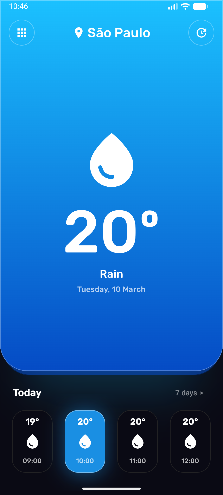
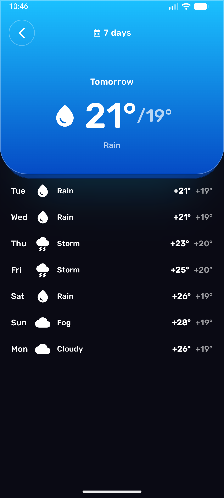
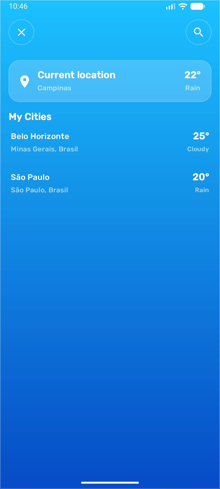

# SimpleWeather

A modern Android weather app built with Jetpack Compose, following Clean Architecture principles and the MVVM pattern.

<p align="center">
  
  &nbsp;&nbsp;
  
  &nbsp;&nbsp;
  
  &nbsp;&nbsp;
  
</p>

---

## Tech Stack

| Layer | Technology |
|-------|-----------|
| **Language** | Kotlin |
| **UI** | Jetpack Compose + Material 3 |
| **Architecture** | Clean Architecture, MVVM |
| **Dependency Injection** | Hilt |
| **Networking** | Retrofit 2 + Moshi |
| **Local Storage** | Room (SQLite) |
| **Async** | Kotlin Coroutines + StateFlow |
| **API** | [Open-Meteo](https://open-meteo.com/) (weather) + [Open-Meteo Geocoding](https://geocoding-api.open-meteo.com/) (city search) |
| **Min SDK** | 31 (Android 12) |

---

## Architecture

The project is organized into three layers following **Clean Architecture**. Each layer has a clear responsibility and dependencies only flow inward (data → domain ← ui).

### Data Layer

Handles all data operations: network calls, local caching, and mapping between external formats and domain models.

```
data/
├── remote/            # API interfaces and DTOs
│   ├── api/
│   │   ├── OpenMeteoApi        ← Retrofit interface for weather forecasts
│   │   └── GeocodingApi        ← Retrofit interface for city search
│   ├── ForecastDto             ← Top-level API response
│   ├── CurrentDto              ← Current weather fields
│   ├── HourlyDto               ← Hourly forecast arrays
│   ├── DailyDto                ← Daily forecast arrays
│   ├── CityListDto             ← Geocoding search response
│   └── CityDto                 ← Single city result
├── local/             # Room database and DAOs
│   ├── AppDatabase             ← Room database definition
│   ├── dao/
│   │   ├── WeatherDao          ← CRUD for cached weather
│   │   └── CityDao             ← CRUD for saved cities
│   └── entity/
│       ├── WeatherEntity       ← Weather cache table
│       ├── CityEntity          ← Saved cities table
│       └── WeatherConverters   ← Room type converters for lists
├── mapper/            # DTO ↔ Domain ↔ Entity mappers
│   ├── WeatherMapper           ← Maps weather across all representations
│   ├── LocationMapper          ← Maps city data across representations
│   └── WeatherConditionMapper  ← Maps WMO codes → WeatherCondition enum
├── repository/        # Repository implementations
│   ├── WeatherRepositoryImpl   ← Fetches from API, caches in Room
│   └── CityRepositoryImpl      ← Searches cities, manages saved list
└── di/                # Hilt modules
    ├── NetworkModule            ← Provides Retrofit, OkHttp, API interfaces
    ├── DatabaseModule           ← Provides Room database and DAOs
    ├── RepositoryModule         ← Binds repository implementations
    └── qualifier/
        ├── WeatherRetrofit      ← Qualifier for weather API Retrofit
        └── GeocodingRetrofit    ← Qualifier for geocoding API Retrofit
```

### Domain Layer

Pure Kotlin — no Android framework dependencies. Defines the business models, repository contracts, and use cases.

```
domain/
├── model/
│   ├── CityInfo                ← City identification and coordinates
│   ├── WeatherReport           ← Aggregates current + hourly + daily
│   ├── CurrentWeather          ← Temperature, condition, day/night
│   ├── HourlyForecast          ← Per-hour temperature and condition
│   ├── DailyForecast           ← Per-day min/max and condition
│   ├── WeatherCondition        ← Enum: CLEAR, RAIN, STORM, SNOW, etc.
│   └── DisplayInfo             ← CityInfo + WeatherReport for the UI
├── repository/
│   ├── WeatherRepository       ← Interface for weather data access
│   └── CityRepository          ← Interface for city data access
└── usecase/
    ├── GetWeatherReportUseCase          ← Fetch fresh weather for a city
    ├── GetSavedCitiesWithWeatherUseCase ← Get saved cities + cached weather
    ├── GetCityListFromNameUseCase       ← Search cities by name
    └── SaveCityUseCase                  ← Persist a city selection
```

### UI Layer

Jetpack Compose screens and components, plus the ViewModel that drives state.

```
ui/
├── theme/
│   ├── Color.kt                ← Weather-specific color palette
│   ├── Theme.kt                ← SimpleWeatherTheme composable
│   └── Type.kt                 ← Typography definitions
└── weather/
    ├── WeatherRoute             ← Stateful entry point (ViewModel ↔ Screen)
    ├── WeatherScreen            ← Stateless main UI composable
    ├── WeatherViewModel         ← StateFlow-based MVVM ViewModel
    ├── WeatherUiState           ← Single state object for the whole screen
    ├── WeatherScreenMode        ← Enum: TODAY, SEVEN_DAY, CITY_PICKER
    └── components/
        ├── WeatherCard          ← Animated blue gradient card container
        ├── TodayCardContent     ← Large card content (icon, temp, condition)
        ├── CompactTomorrowContent ← Small card with tomorrow's forecast
        ├── CityPickerContent    ← Full-screen city selection and search
        ├── HourlyForecastCard   ← Single hourly forecast item
        ├── SevenDayList         ← 7-day forecast list
        ├── WeatherTopBar        ← Top bar with navigation and city name
        └── WeatherIcon          ← Maps WeatherCondition → Material Icon
```

---

## Data Flow

The following diagram shows how data flows through the app when the user views weather for a city:

```
┌──────────────────────────────────────────────────────────────────────┐
│                              UI LAYER                                │
│                                                                      │
│  WeatherRoute ──► WeatherViewModel ──► WeatherUiState                │
│       │                  │    ▲              │                        │
│       │           calls  │    │ Result<T>    │ collected by           │
│       │          use cases    │              ▼                        │
│       │                  │    │         WeatherScreen                 │
│       │                  ▼    │         (+ components)               │
├──────────────────────────────────────────────────────────────────────┤
│                           DOMAIN LAYER                               │
│                                                                      │
│  GetWeatherReportUseCase ──────► WeatherRepository (interface)       │
│  GetSavedCitiesWithWeatherUseCase ──► CityRepository (interface)     │
│  GetCityListFromNameUseCase ──► CityRepository (interface)           │
│  SaveCityUseCase ──────────────► CityRepository (interface)          │
│                                       │                              │
├───────────────────────────────────────┼──────────────────────────────┤
│                           DATA LAYER  │                              │
│                                       ▼                              │
│                          RepositoryImpl                              │
│                           ┌─────┴─────┐                              │
│                           ▼           ▼                              │
│                     OpenMeteoApi   Room DB                           │
│                     GeocodingApi   (WeatherDao,                      │
│                           │         CityDao)                         │
│                           ▼           │                              │
│                        DTOs ──mapper──► Domain Models                │
│                                   ◄──mapper── Entities               │
└──────────────────────────────────────────────────────────────────────┘
```

**Refresh flow (cache-then-network):**

1. ViewModel calls `GetSavedCitiesWithWeatherUseCase` → reads **cached** weather from Room
2. UI renders immediately with cached data
3. ViewModel calls `GetWeatherReportUseCase` → hits the **Open-Meteo API**
4. Repository maps the DTO to a domain model and caches it in Room
5. ViewModel updates `WeatherUiState` with fresh data → UI recomposes

---

## MVVM Pattern

The app follows **Model-View-ViewModel** with unidirectional data flow:

```
  User action          State update           UI render
  (tap, pull)          (ViewModel)            (Compose)
      │                     │                     │
      ▼                     ▼                     ▼
  ┌────────┐   events   ┌──────────────┐  state  ┌──────────────┐
  │  View  │ ─────────► │  ViewModel   │ ──────► │    View      │
  │(Screen)│            │              │         │  (recompose) │
  └────────┘            │ WeatherUiState         └──────────────┘
                        │ (StateFlow)  │
                        └──────┬───────┘
                               │ calls
                               ▼
                        ┌──────────────┐
                        │   Use Cases  │
                        └──────────────┘
```

### Key principles applied

- **Single source of truth:** `WeatherUiState` is one immutable data class exposed as a `StateFlow`. Every piece of UI state lives here — screen mode, current weather, search results, loading flags, errors.

- **Unidirectional data flow:** The UI emits events (lambda callbacks like `onRefresh`, `onGridClick`, `onSevenDaysClick`). The ViewModel processes them, updates the state, and Compose recomposes automatically. The UI never mutates state directly.

- **Stateful vs stateless split:** `WeatherRoute` is the stateful composable that wires the ViewModel to the screen. `WeatherScreen` is fully stateless — it receives state and lambdas, making it easy to preview and test.

- **ViewModel owns business logic:** Screen mode transitions, debounced search, cache-then-network refresh, and error handling all live in `WeatherViewModel`. The composables are purely presentational.

- **Use cases as the ViewModel's API to data:** The ViewModel never touches repositories directly. Each operation goes through a focused use case (`GetWeatherReportUseCase`, `SaveCityUseCase`, etc.), keeping the ViewModel lean and the domain layer testable in isolation.
